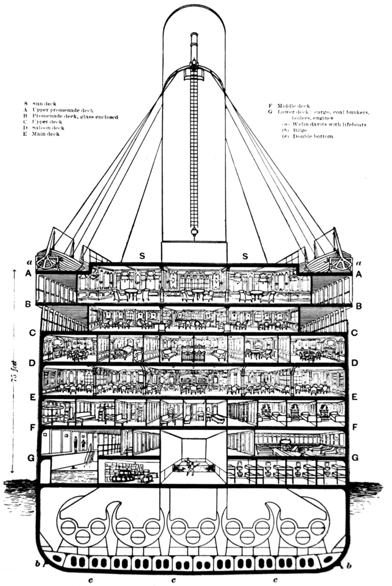
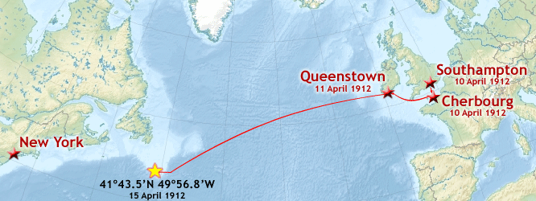

# titanic_problem
# Titanic dataset to predict passenger survival

# Floor Plan

# Route

**Features**

- **survival** - Survival (0 = No; 1 = Yes)
- **class** - Passenger Class (1 = 1st; 2 = 2nd; 3 = 3rd)
- **name** - Name
- **sex**- Sex
- **age**- Age
- **sibsp** - Number of Siblings/Spouses Aboard
- **parch** - Number of Parents/Children Aboard
- **ticket** - Ticket Number
- **fare** - Passenger Fare
- **cabin**- Cabin
- **embarked** - Port of Embarkation (C = Cherbourg; Q = Queenstown; S = Southampton)
